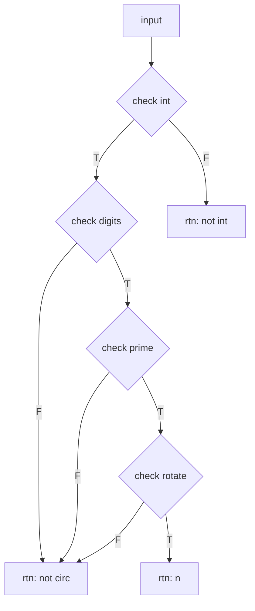
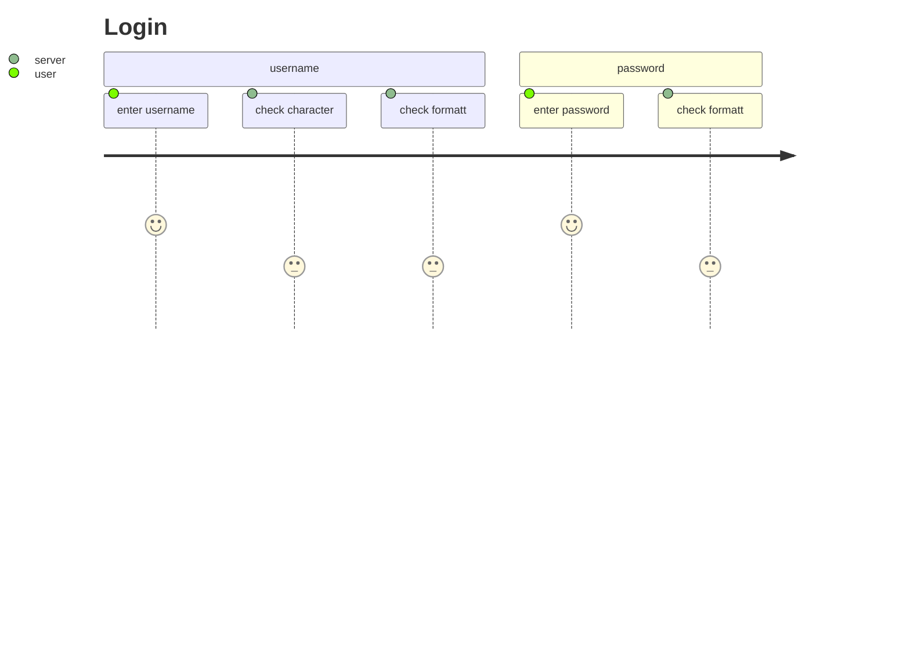

# 1.2 nthCircularxx

## mermaid



---

- 3 个条件依次判断
- rev
  - 思路没问题
  - 卡在细节

## uml-simple

```puml
start

- n
if (check int) then
        stop
    else (T)
if (check digit) then
        stop
    else (T)
if (check prime) then
        stop
    else (T)
if (check rotate) then
        stop
    else (T)
- n

stop
```

---

## uml-detailed

```puml
start

- check int
    if (type(n) == int) then(T)
    else
        -> F, rtn "not int";
        stop
    endif
- check digit
    note right
        0, 5
        * 509 -> 950, 95
        2, 4, 6, 8 - 2n
        * 29 -> 92
    end note
    -> n not have(0, 5, 2n);
    if (digit % x != 0) then(T)
    else
        -> rtn: not circ;
        stop
    endif
- check prime
    if (is_prime(n) == T) then (T)
    else
        stop
    endif
- check rotate
-> rotate[bac, cba] are prime;
    if (is_prime(rotate) == T) then (T)
    else
        stop
    endif
-> rtn n;

stop
```

---

## uml-free

```puml

rectangle input
card check_int
card check_digit
card check_prime
card check_rotate

input -r->  check_int
    check_int -> check_type
check_int --> check_digit
    check_digit -> 0_5_2n
    0_5_2n --> stop
check_digit --> check_prime
    check_prime -> is_prime
check_prime --> check_rotate
    check_rotate -> bca
    bca -> cab
check_rotate --> output

```

---

## uml-test

```puml

left to right direction
skinparam packageStyle rectangle
actor customer
actor clerk
rectangle checkout {
  customer -- (checkout)
  (checkout) .> (payment) : include
  (help) .> (checkout) : extends
  (checkout) -- clerk
}

```

---

## mermaid test



---

## flowchart.js

```flow
st=>start: start
e=>end: end

op1=>operation: digitCircular
op2=>operation: is_prime
op3=>operation: digitRotate

cond=>condition: digitCircular
cond2=>condition: is_prime
para=>parallel: parallel tasks

st->op1->cond
cond(yes)->cond2(yes)->e
cond(no)->op1
```

语法很严格
判断必须要拼 yes
需要很多的声明
