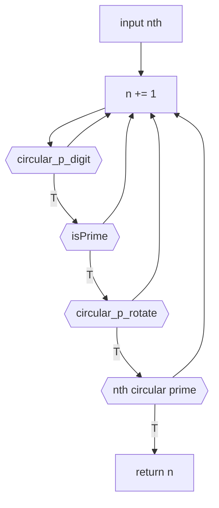
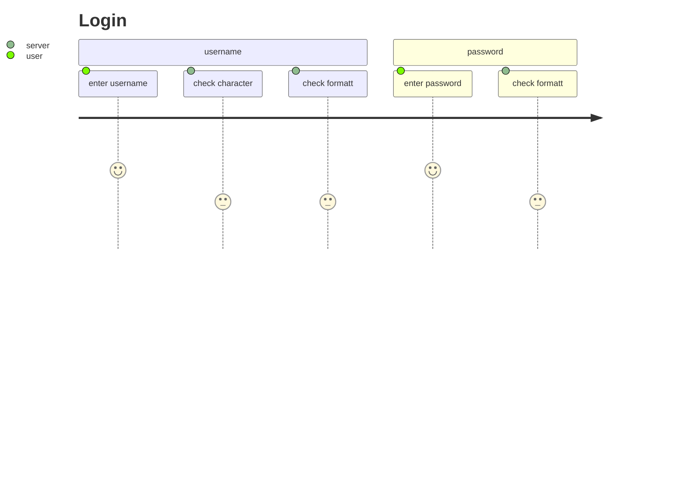

# 1.2 nthCircularxx

## mermaid



---

- 3 个条件依次判断
- rev
  - 思路没问题
  - 卡在细节

## uml-simple

```puml
start

-> input nth;
- circular_p_digit
- isPrime
- circular_p_rotate

-> return n;
stop
```

## uml-detailed

```puml
start
- input nth

repeat
    repeat
        repeat

            repeat
            - n = n + 1
            partition circular_p_digit {
                - n % 0 != 0
                - n % 5 != 0
                - n % 2 != 0
            }
            repeatwhile () is (F)
        partition isPrime {
            - n
        }
        repeatwhile () is (F)
    repeatwhile (circular_p_rotate(n)) is (F)
- n, as a circular prime
repeatwhile (n is the nth circular prime) is (F)

- return n
stop
```

```puml
start

    while (circular_p_digit)
    - n=n+1
    endwhile

stop
```

---

## uml-free

```puml

rectangle input
card check_int
card check_digit
card check_prime
card check_rotate

input -r->  check_int
    check_int -> check_type
check_int --> check_digit
    check_digit -> 0_5_2n
    0_5_2n --> stop
check_digit --> check_prime
    check_prime -> is_prime
check_prime --> check_rotate
    check_rotate -> bca
    bca -> cab
check_rotate --> output

```

---

## uml-test

```puml

left to right direction
skinparam packageStyle rectangle
actor customer
actor clerk
rectangle checkout {
  customer -- (checkout)
  (checkout) .> (payment) : include
  (help) .> (checkout) : extends
  (checkout) -- clerk
}

```

---

## mermaid test



---

## flowchart.js

```flow
st=>start: start
e=>end: end

op1=>operation: digitCircular
op2=>operation: is_prime
op3=>operation: digitRotate

cond=>condition: digitCircular
cond2=>condition: is_prime
para=>parallel: parallel tasks

st->op1->cond
cond(yes)->cond2(yes)->e
cond(no)->op1
```

语法很严格
判断必须要拼 yes
需要很多的声明
